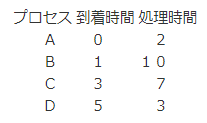
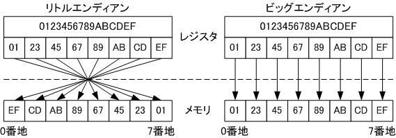

OS論期末レポート 2210342 鈴木謙太郎

## ファイルシステムの話

### 標準入出力とシステムコール

- writeシステムコールに第1引数で与えている番号は「ファイルディスクリプタ」とよばれるものである。
1が標準出力、2が標準エラー出力である。第2引数は出力する文字が格納されているバッファ、第3引数は出力する文字数である。

- readシステムコールは第1引数のファイルディスクリプタとして0を渡すと標準入力を読める。 第2引数は読み込んだ文字を格納するバッファ、第3引数は読み込む文字数である。

- openシステムコールはファイルを開くためのシステムコールである。第1引数にファイル名、第2引数にオープンモードを指定する。オープンモードは読み込み専用、書き込み専用、読み書き両方などがある。

- closeシステムコールはファイルを閉じるためのシステムコールである。第1引数にファイルディスクリプタを指定する。

### ファイルシステムって何？

ファイルの集まりを管理する仕組み。木構造の階層的な名前空間で表される。絶対パス、相対パスなど

> [!NOTE]
> `ファイル = iノード + 0個以上のデータブロック`
>
> iノードにはファイルの所有者、種類、アクセス許可、アクセス時刻、リンク数、実際のデータ領域へのポインタなどが格納されている。
> ※ファイル名は格納されていない
>
> - ディレクトリエントリにファイル名と対応するiノードをセットで保管しているので、ファイル名の変更やディレクトリ操作が容易
> - 複数のファイルが同じiノードを指せるハードリンクの実現に必要
> - ファイル名を含めないことでiノードのサイズが一定になる。効率良い管理が実現される

- ハードリンク: 1つのiノードを複数のファイル名で参照すること
- シンボリックリンク: 1つのiノードを参照するファイル名を別名で参照すること
- `cp`によるコピーは異なるiノードを持つ新しいファイルを作成する

## プロセス管理の話

プロセス: 1つの計算機で多数のプログラムを動作させるための仕組み。仮想的なCPU+メモリ空間

- 実行可状態→実行状態: CPUを割り当てて実行
- 実行状態→実行可状態: 割り込まれた
- 実行状態→待ち状態: IO待ちなど。
- 待ち状態→実行可状態: IO待ちなどが完了したら再度実行可状態になったり

### fork / waitの話

子プロセスを生成して実行するためのシステムコール。
forkから下の処理が親子プロセスの両方で実行される

> [!WARNING]
> 親側で明示的にwaitしない限り親プロセスは子プロセスの終了を待たないので注意

- 親プロセスが先に終了しても子プロセスは動き続ける。ただしシェルは親プロセスだけ見ているので、子プロセスのシェルへの出力がおかしくなる
- waitしなかった場合子プロセスがゾンビプロセスになるのを防ぐため、PID1のinitプロセスが子プロセスの終了を待つ
  - ので親が消えた子プロセスのPPIDは1になる

```c
#include <stdio.h>
#include <stdlib.h>
#include <sys/wait.h>
#include <unistd.h>
int main() {
  int pid, w;
  printf("before fork(): getpid() = %d\n", getpid());
  if ((pid = fork()) == 0) { /* child process */
    printf("I'm a child. pid = %d, getpid() = %d\n", pid, getpid());
    exit(0);
  } else if (pid == -1) { /* error */
    perror("fork");
    exit(1);
  } else { /* parent process */
    printf("I'm a parent. pid = %d, getpid() = %d\n", pid, getpid());
  }
  if ((w = wait(NULL)) == -1) {
    perror("wait");
    exit(1);
  }
  printf("I'm a parent. w = %d\n", w);
  exit(0);
}
// before fork(): getpid() = 9488
// I'm a parent. pid = 9489, getpid() = 9488
// I'm a child. pid = 0, getpid() = 9489
// I'm a parent. w = 9489
```

```c
#include <stdio.h>
#include <stdlib.h>
#include <sys/wait.h>
#include <unistd.h>
int main() {
  int i, status;
  for (i = 0; i < 5; i++) {
    if (fork() == 0) exit(i);
    wait(&status); // statusに詰められる終了コードは8ビット左シフトされていることに注意
    printf("status = %d\n", status);
  }
  return 0;
}
// status = 0
// status = 256
// status = 512
// status = 768
// status = 1024
```

### jmpの話

`setjmp`と`longjmp`は、C言語で使用される非局所的なジャンプ関数。これらの関数を使うことで、プログラムの実行を現在の関数から別の関数にジャンプさせることができる。これらの関数は、エラーハンドリングや非同期イベント処理のために利用されることが多い。現在の実行一を保存して後からそこに戻るフローが一般的

`setjmp`: ジャンプ先のコンテキストを保存する

- 引数env: 保存された実行環境を格納する変数
- 返り値: 初回呼び出し(保存)時には0を返す。longjmpで戻った場合はlongjmpの引数に渡した値を返す

`longjmp`: 保存されたコンテキストに戻る

- 引数env: 保存された実行環境。setjmpに渡したものを渡す
- 引数val: setjmpに返す値

### プロセス制御ブロック(PCB)

各プロセスの属性を記述している

- PCBをつなぐポインタ
- PID
- 親プロセスへのポインタ
- プロセスの状態(実行中、待ち、実行可など)
- 優先度
- 利用者領域のポインタ
- プロセスコンテクスト(CPUレジスタ・MMU)
- 割り当てられた資源情報
- 入出力情報

### プロセス切り替え

- プロセスコンテクストをPCBの該当領域へ対比
- 次のプロセスをスケジューラが選ぶ
- 次のPCBをプロセスコンテクストへロード

## CPU管理の話

1つのCPUで複数のプロセスを実行するためにCPUスケジューリングをやる

- 並行処理だから速くなるわけではないが...
  - スループット向上(IO多重化やプリンタのスプーラ)
  - 平均待ち時間が減る(10分の仕事が1つと1分の仕事が3つ)

### スケジューリング評価基準

以下について`平均|最悪|最善`のいずれかを優先して頑張る

- スループット: 単位時間あたり仕事量
- CPU使用率: CPU動作時間 / システム稼働時間
- ターンアラウンド時間: ジョブの実行要求から終了までの時間(最初に実行キューに入ってから実行終了までの時間)
- 待ち時間: ジョブの完了までの実行可キューで待つ時間の合計
- 応答時間: ジョブの要求から最初の応答まで(最初に実行キューに入ってから実行開始までの時間)

### CPU横取りとは？

OSが現在実行中のプロセスを中断し、別のプロセスにCPUの制御を移す仕組み。
システム全体の応答性とスループットを向上させるために行われる。

どのようなタイミングで割り込まれるかは下の割り込みを参照すること

### CPU横取りなしスケジューリング

1. 到着順: FIFOの実行可キューで順に実行。単純だが性能は悪い
2. 最短時間順番: 実行時間の短いものから実行。平均待ち時間は小さくなるが、実行時間が長いものは待たされる
   - 1タスク終わるごとに、その時点でキューにあるものの中で最短時間のものを実行する

3. 優先度順: プロセスに優先度を付けて、同じものは到着順。低優先度のものが永遠に実行されない可能性があるので定期的に優先度を変えるべき

### CPU横取りありスケジューリング

- 最小残余時間優先: 横取りのある最短時間順番。新しいジョブが実行中のジョブより短い実行時間を持っている場合、先に新しいジョブを実行する
- ラウンドロビン: **時分割システム用** 数十ms程度のタイムスライスでCPUを割り当て。FIFOキューで順番に実行。実行後はキュー末尾へ
- 多重レベル: 実行可キューを複数用意してキューごとにアルゴリズムを変える
- 多重レベルフィードバック: ジョブがキュー間を移動する多重レベル

## ラウンドロビンなどなど例題

到着順、処理時間順、最小残余時間優先、
ラウンドロビン（タイムスライス２）について、
平均ターンアラウンド時間と平均応答時間を求める



### 到着順

`AA|BBBBBBBBBB|CCCCCCC|DDD`

- 平均ターンアラウンド時間: `（2+11+16+17）/4＝11.5`
- 平均応答時間: `（0+1+9+14）/4＝6`

### 処理時間順

`AA|BBBBBBBBBB|DDD|CCCCCCC`

- 平均ターンアラウンド時間: `（2+11+19+10）/4＝10.5`
- 平均応答時間: `（0+1+12+7）/4＝5`

### 最小残余時間優先

`AA|B|CC|DDD|CCCCC|BBBBBBBBB`

- 平均ターンアラウンド時間: `（2+21+10+3）/4＝9`
- 平均応答時間: `（0+1+0+0）/4＝0.25`

### ラウンドロビン

`AA|BB|CC|BB|DD|CC|BB|D|CC|BB|C|BB`

- 平均ターンアラウンド時間: `（2+21+17+10）/4＝12.5`
- 平均応答時間: `（0+1+1+3）/4＝1.25`

## 記憶管理の話

### エンディアンによるメモリ配置の違いの話

```c
#include <stdio.h>
#include <unistd.h>
#include <stdlib.h>
int
main()
{
        int *p;
        p = (int *)NULL;
        printf("*p = %x\n",*p); // *p = 78563412
        *p = 0x1234;
        printf("*p = %x\n",*p); // *p = 1234
        return 0;
}
```

この様になる理由は数値がリトルエンディアンで格納されているためである。
実際に*p = 0x1234;の後にdの中身を出力すると以下のようになる。

`
d[0] = 34, d[1] = 12, d[2] = 0, d[3] = 0
`

> [!NOTE]
> エンディアンは、コンピュータのメモリにデータを配置する際のバイトの順序を定義した方式のことを指す。
>
> 特にマルチバイトのデータ表現において重要となり、バイトを先頭から順に配置する「ビッグエンディアン」と、
> 末尾から逆順に配置する「リトルエンディアン」の2つが存在する。
> 
>

### メモリなど

- 主記憶装置(速い、小さい、高い)
- 二次記憶装置(遅い、大きい、安い)

記憶階層: `キャッシュ` -> `主記憶装置` -> `二次記憶装置` -> `外部記憶装置`

- キャッシュなどに優先的に置くもの: プログラムカウンタ、スタックポインタ、レジスタなど実行時に頻繁にアクセスするものから

多重for文などでは、メモリアクセス先アドレスが極力近くなるように書こう

### 仮想記憶

ハードウェアの助けを借りて自動的に小さい記憶を大きく見せるためのしくみ

配置法:

- 先頭一致: 先頭から空き領域を探し、最初に見つかった配置可能な領域に配置する
- 最適配置: 配置できる最小の領域に配置する
- 最悪配置: 配置できる最大の領域に配置する

置換法: FIFO / LRU(Last Recently Used)など

### アドレス管理

MMUが仮想アドレスと実アドレスを対応させる

- ある程度のブロック単位でやる
  - ブロックサイズ固定: ページング
  - ブロックサイズ可変: セグメンテーション

- 仮想アドレス / 論理アドレス
  - プロセスから見たアドレス
  - プロセスが出すアドレス
- 実アドレス / 物理アドレス
  - メモリ上のアドレス

### 参照の局所性

- 時間的局所性: 最近参照されたデータは近い将来も参照される可能性が高い
- 空間的局所性: 参照されたデータの近くのデータは参照される可能性が高い

## 割り込みの話

- リセット
- 入出力の完了
- FPUの例外
- メモリ管理の例外(ページフォールトなど
- CPUの例外(ゼロ除算など)
- システムコールなどのソフトウェア割り込み

### 割り込みが起こると

1. 割込みの禁止:
すべての割込みを禁止する
もしくは、レベルがあって割込みを禁止する

2. カーネルモードへの移行
3. 割り込んだ状態の保存
4. 割り込みハンドラの実行
5. 割り込みハンドラの終了
6. 保存した状態を復元して元の処理を再開する

### ALRMの話

プログラムが終了したり、シグナルを受け取ったりするときに特定の処理を実行させることができる。
GracefulなShutdownに役立つ。
`alarm()`関数で`SIGALRM`を送信することができる。

```c
#include <stdio.h>
#include <stdlib.h>
#include <unistd.h>
#include <signal.h>
void
ringring(int sig)
{
        printf("process[%d]: signal(%d) received\n",getpid(),sig);
}
int
main()
{
        signal(SIGINT,ringring);
        signal(SIGTERM,ringring); // SIGKILL以外は、対応したシグナルハンドラを設定することで
        signal(SIGALRM,ringring); // シグナルを受け取った時の処理をカスタマイズできる
        signal(SIGKILL,ringring); // SIGKILLはOS側で強制終了がかかるのでハンドラを設定しても実行されない
        for(;;);
        /* NOT REACHED */
}
```

### タイマ割り込み

タイマー割り込みは、コンピュータのオペレーティングシステム（OS）が特定の時間間隔で実行するための仕組み。
この仕組みにより、OSは時間の経過を追跡し、定期的にタスクを実行できる。
ex: UNIX TIME

1. ハードウェアタイマーが一定の間隔(数～数十ms)で割り込み信号を発生させる
2. CPUはタスクを一時停止して割り込みハンドラを実行する(OSが事前に設定している)
