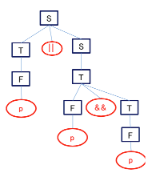
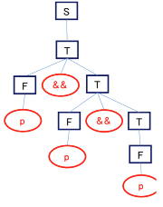
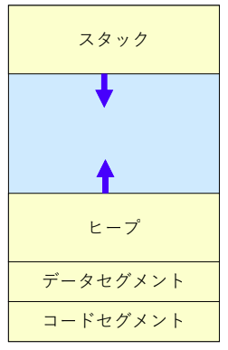
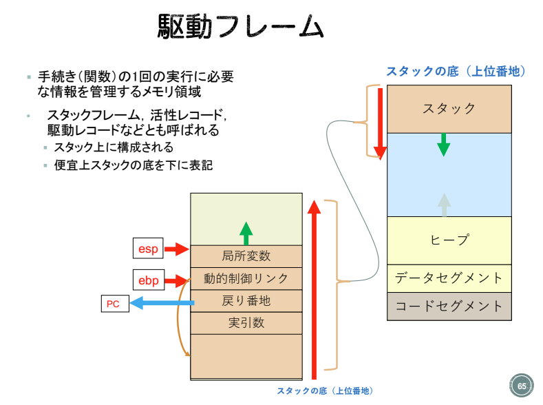
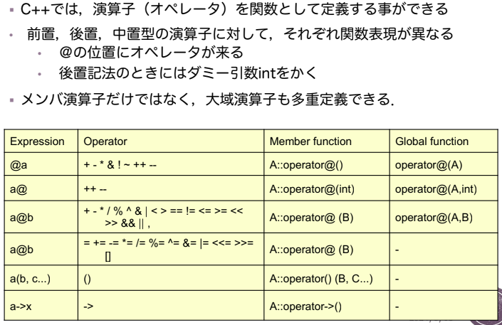

## プログラミング言語全般

### 分類

#### 手続き型言語

- 命令型言語
  - フォン・ノイマン型コンピュータアーキテクチャ
  - Fortran(1958), Algol(1960), Pascal(1970), c(1972)
  - プログラム=アルゴリズム+データ構造 (N.Wirth=PASCAL開発者)

#### 非手続き型言語

- 関数型言語
  - 関数適用(λ算法)
  - Lisp(1958)
- 論理型
  - 一階述語論理(単一化、バックトラック)
  - アルゴリズム=論理+制御 (Kowalski=Prolog開発者)
  - Prolog(1972)
- オブジェクト指向言語
  - メッセージ通信
  - 部品化(モジュール化)
  - Smalltalk(1972), C++(1983), Java(1995)

### 構文定義: BNF

例題: 下記の論理式のBNGに対して以下の問に答えよ

$$
\begin{align}
  \text{S} & ::=  \text{T '||' S | T} \\
  \text{T} & ::=  \text{F '\&\&' T | F} \\
  \text{F} & ::=  \text{'!' F | '(' S ')' | 'p'}
\end{align}
$$

1. 文 p && !p || pを最左導出法で導出せよ

```
S- > T || S -> F && T || S -> p && T || S -> p && F || S
-> p && !F || S -> p && !p || S -> p && !p || T
-> p && !p || F -> p && !p || p
```

2. 文 p || p && pの構文解析木を示せ。また&&と||の優先順位を示せ

  構文解析木から`(p||(p&&p))`となるので,論理積の優先度が高い

3. 文 p && p && pの構文解析木を示せ。また、&&が右結合的か左結合的か答えよ

 構文解析木から`(p&&(p&&p))`となるので,右結合

### 後置記法と中置記法の変換

(a)では,後置記法を中値記法に変換せよ.必要なら括弧をいれること
(b)では中値記法を後置記法に変換せよ. ただし,文字の出現順は変えないこと

a. `a b – c / d e – f g+ *+` → `((a– b) / c ) + ((d – e)* (f + g))`

b. `x = (a + b) * (c - d - e)` → `x a b + c d - e - * =`

## 命令型言語

### 右辺値と左辺値

代入文において左辺値: メモリの位置(アドレス), 右辺値: メモリの値

### データ型

<div style="display:flex">
変数のメモリ割り当て

- 関数:コードセグメント
- 大域変数:データセグメント
- 局所変数:スタック
- 動的変数:ヒープ



</div>

#### Cにおける変数とメモリ割り当て

```c
#include <stdio.h>
#include <stdlib.h>
int gl; // 大域変数: データセグメント
static int st; // 大域変数: データセグメント
void func(int n) // 関数: コードセグメント
{
int i; // 局所変数: スタック
printf("&n: %p¥n", &n); /* stack for parameter n */
printf("&i: %p¥n", &i); /* stack for local var i */
}
int main() // 関数: コードセグメント
{
int i; // 局所変数: スタック
int *p = malloc(100 * sizeof(int)); // 動的変数: ヒープ/
func(i);
return 0;
}
```

### 駆動

プログラムの制御

- プログラムは機械語命令としてコードセグメントにロード
- プログラムカウンタ(PC)
- プログラムの現在実行中の行のアドレスを指示する.
  - 通常は順次次の行に移動していく.

#### 関数呼び出しとリターン

1. 呼び出し側は,実引数を評価して,駆動フレームに格納する
2. 呼び出し側プログラムの現在行のアドレスやレジスタなど,呼び出し側に戻ってきたときの再実行のための情報を保存する.
3. プログラムカウンタを変更して,新しい手続きを呼び出す
4. 呼び出された側は,自分の局所変数のための領域を確保する
5. 呼び出された側の手続きの本体を実行する
6. リターン値を格納した後,制御は呼び出し側に戻される.プログラムカウンタやレジスタ情報が復元される.

#### 駆動フレーム



ex: 再帰関数の呼び出しやリターンがどのように実現されているかを簡単に説明せよ.

関数の呼び出しは,スタック上に駆動フレーム(関数フレーム)という,実引数,戻り番地,動的制御リンク,仮引数,局所変数を保持する領域を Push することによって行われる.

この時,プログラムカウンタ(PC),スタックポインタ(esp),ベースポインタ(ebp)という3つのレジスタも更新される.
呼び出し元関数は,実引数値を計算し,戻り番地として現在のPCの次のアドレスを入れ,自分の動的制御リンクのアドレスを駆動フレームに保存した後,
PCに呼び出し関数のアドレスを入れることによって,呼び出し関数に制御を渡す.
呼び出された関数は,自分の仮引数や局所変数の領域を駆動フレーム上にPushし,実引数値を仮引数にコピーしたのち,本体を実行する.
Return文で実行が終わると,スタック上に確保した領域を次々に Pop して解放する.
その際に,ベースポインタを元の駆動フレームのアドレスに戻し,戻り番地をPCに入れることによって,呼び出し元関数に制御を戻す.

## オブジェクト指向言語

オブジェクトにより,計算対象をカプセル化し,オブジェクトの特徴を利用して計算対象に統一したモデルを与える.

- オブジェクトの構成
  - 名前
  - 属性
  - 操作
- オブジェクト間の相互作用: メッセージによる通信

### クラス・インスタンス

- クラス:オブジェクトの定義
  - 共通する属性,操作を持つオブジェクトをまとめるためのテンプレート
- インスタンス:クラスから生成されたオブジェクト
  - 属性名,操作はクラスと同じ
  - オブジェクト名,属性値は異なる

メッセージ通信によるオブジェクトの動作

- 機能
  - オブジェクト間の情報交換
  - オブジェクトの状態変換(属性値変更)
- メッセージ通信の構成
  - 送り先オブジェクト名, 操作名, 操作引数, 返信

### カプセル化・情報隠蔽

カプセル化

1. オブジェクトに特有なデータ構造と操作をまとめて
2. 公開されたインタフェースのみを通じて外部と通信できるようにする方法

- 情報隠蔽: オブジェクトをカプセル化して,内部データやその処理方法などの具体的実現方法の詳細が外部から見えなくするための技法

- 抽象データ型

#### 表現独立・実現隠蔽

表現独立(Representation Independence):オブジェクトの表現を,プログラムの他の部分に影響を与えずに変更できるようにするための技法

- 抽象仕様:オブジェクトの動作を実装から独立に記述すること
- 具象表現:オブジェクトの動作の実装法

実現隠蔽(Information Hiding):具象表現のために, 実現部を公開の仕様から隠して記述する事

- インタフェース
  - 型,変数,手続きの宣言の集合
  - モジュールの公開部と呼ぶ
- 実現部
  - 手続きの本体
  - モジュールの非公開部と呼ぶ

```cpp
class ListStack {
  private: // 実現部
    Node* top;
    int count;
  public: // ここが公開されたインタフェース
    ListStack();
    void Push(int element);
    int Pop();
    int Size();
};
ListStack() { // ここから下も実現部
  top = NULL;
  count = 0;
}
void ListStack::Push(int element) {
Node* temp = new

Node();

temp->data = element;
temp->link = top;
top = temp;
count++;
}
```

### アクセス制御

情報隠蔽のために,メンバ変数やメンバ関数のどれを誰からアクセス可能にするかを制御すること

- アクセス指定子によるメンバーのアクセス制御
  - public: 公開メンバとなり,外部からアクセス可能
  - private: 非公開メンバとなり,外部からはアクセス不能.自クラスのメンバ関数からはアクセス可能
  - protected: 保護メンバとなり,外部からのアクセス不能,自クラスおよび,導出クラスのメンバ関数からはアクセス可能
- デフォールトアクセス制御
  - classでは,アクセス制御子がなければ,非公開メンバ
  - structでは,アクセス制御子がなければ,公開メンバ
- Friend宣言によるアクセス制御
  - 非公開(private)メンバを他のクラスからアクセスできるようにする.

### 継承周り

#### 部分型の原理

部分型:オブジェクトTに適用できるすべての操作が,オブジェクトSにも適用できる時,SをTの部分型,TはSの上位と呼ぶ

部分型の原理:部分型のオブジェクトは,上位の型が予期されるところには,どこにでも表れることができる

#### アクセス制御

導出クラスでは,基底クラスと同じアクセス条件を継承

- public: 導出クラスでもpublicメンバとなる
- protected: 導出クラスでもprotectedメンバとなる
- private: 導出クラスではアクセス不可

※非公開基本クラスの場合

- public, protected: 導出クラスではprivate メンバとなる
- private: 導出クラスではアクセス不可

#### メモリ割り当て

生成時の連鎖順にオブジェクトのメモリが割り当てられる.
`基底クラスの生成→ メンバクラスの生成→自クラスの生成`

局所変数 / 動的変数のメモリ割り当ては、上に挙げたものと同じ

### 多重定義とか



```cpp
class complex{
private:
double real, imaginary;
public:
complex();
complex(double a, double b=0.0);
complex(const complex& y); // コピーコンストラクタ: 生成時に初期化される際. complex c1(0,0);complex c2 = c1;
~complex(); // デストラクタ。こいつをvirtual宣言すると抽象クラスになる
double abs();
complex operator+(const complex&y);
complex operator-(const complex&y);
complex operator*(const complex&y);
complex operator/(const complex&y);
void operator=(const complex& y); // 代入演算子の多重定義。初期化意外の代入文で使用
void display();
virtual int area (void) =0; // 純粋仮想関数。こいつがあると抽象クラスになる
};
```

## 関数型言語

ラムダ計算を計算モデルとするプログラミング言語

1. 純関数型プログラミング
   - 参照透過性:式の値があれば,それは,その部分式の値にだけ依存する.
   - 単一代入:代入文のない副作用のない世界
2. 第一級関数
   - 関数は,他のすべての値と同じ地位を持つ.関数は式の値となりえる.関数を引数として渡すこともできる.また関数をデータ構造の中に収めることもできる.
3. 暗黙の領域管理
   - データ領域に関する組み込み操作が,必要に応じてメモリ領域を確保する.アクセスできなくなったメモリ領域は,自動的に開放される.
   - Garbage Collection (GC):メモリ管理の自動化

> [!NOTE]
> 一等値(第一級オブジェクト): <br>
> プログラミング言語において,たとえば生成,代入,演算,(引数・戻り値としての)受け渡しといったその言語における基本的な操作を制限なしに使用できる対(データ型)のこと

### ラムダ式

省略規則

- 関数適用は関数抽象より優先度が高い`λx.xz → λx.(xz)`
- 関数適用は左結合性を満たす`xyz → (xy)z`
- 関数抽象の並びは,1つのラムダ式にまとめることができる`λxyz.M → (λx. (λy . (λz.M)))`

簡約化

- λx.x =β λz.z
- λxy.x =β λuv.u
- M =β Mʼかつ N =β Nʼ ならば MN =β MʼNʼ
- (λxyz.xz(yz)) (λx.x) (λx.x) = (λxyz.xz(yz)) (λu.u) (λx.x)
= (λyz. (λu.u) z (yz))
(λx.x)
= (λyz. z (yz)) (λv.v)
= (λz. z ((λv.v) z))
= λz. z z

コンビネータ
`AND T T = TTF = T` , `OR T F = TFF = T` , `NOT T = T F T = F`

### Lisp

ドット対(s1 ・　s2)のs1をcar部(CAR s1),s2をcdr部(CDR s1)と呼ぶ

## 論理型言語

```
<プログラム> ::= { <規則> | <事実> | <ゴール>}*
<規則>::= <リテラル> “:-” <リテラル> {”, ”<リテラル> }*”.“
<事実>::= <リテラル> “.”
<ゴール>::= <リテラル> {”,” <リテラル> }* ”.”
<リテラル>::= <述語> | ”not(“ <述語> ”)“
<述語> ::= <述語名> ”(”<項> {”, ”<項> }* “)”
<項> ::= <定数> | <変数> | <関数> | <項><演算子><項> | ”(”<項>”)”
<関数> ::= <関数名>”(”<項> {”, ”<項> }*”)”
```

Prologのトップレベルループ

1. ?- :質問入力待ちのプロンプト㱺<ゴール>の入力
2. yes, no, :真偽の結果して,1に戻る
3. X=.. yes: 変数に対する解を表示して,1に戻る
4. X=.. ? : 別解探索のための入力待ち㱺;の入力

リストの表記法

- [a, b, c]
  - Lispにおけるリスト表記法 (a b c) に対応
- [a | [b, c]]
  - Lispにおけるリスト表記法 (a . (b c))に対応
  - Head=a, Tail=[b,c]とすると,[Head | Tail]と表記できる.

Lispにおけるリスト処理の基本関数はcar,cdr,consである.

- (car ʻ(a b c)) => a, (cdr ʻ(a b c))=> (b c), (cons ʻa ʻ(b c))=>(a bc)

Prologでは単一化だけで実現

- [Head | Tail]=[a, b, c]
  - Head=a, Tail=[b,c]

Append関係

1. 第1引数が空リストなら,第2引数と第3引数は同じでなければならない.
2. 第1引数が空リストでないならば,リス
トのHeadは,第3引数のリストのヘッ
ドと一致しなければならないし,リス
トのBodyと第2引数を連接した結果は,
第3引数のBodyと一致しなければなら
ない

```
append([], Y, Y).
append([H|X], Y, [H|Z]) :- append(X, Y, Z)


?- append([a, b], [c, d], Z).
Z=[a, b, c, d]
?- append([a, b], Y, [a, b, c, d],).
Y=[c, d]
?- append(X, [c, d], [a, b, c, d).
X=[a, b]
?- append(X, Y, [a, b, c, d]).
X=[], Y=[a, b, c, d] ;
X=[a], Y=[b, c, d] ;
X=[a, b], Y=[c, d] ;
X=[a, b, c], Y=[d] ;
X=[a, b, c, d], Y=[] ;
no
```

### 論理型言語とは

一階述語論理における導出を計算モデルとするプログラミング言語

1. 論理プログラミング:プログラムとして,規則と事実を表す論理式を宣言的な
知識として与えておくと,質問を示す論理式に対して,論理推論によって,解
を求める.
2. 関係による計算:入力から出力を計算する関数ではなく,変数間の関係を表す
述語によって方向性のない計算が可能となる.
3. パターンマッチングとバックトラック:単一化によって,変数を含む項の間の
パターンマッチングが可能となり,入出力の方向性のない変数の利用が可能と
なる.また,言語処理系自体にバックトラックという探索機能が備わっていて,
質問に対する解計算に用いられる.

### 命題論理

命題(Proposition)と呼ばれる対象世界の事柄に関する言明とその推論を体系化したもの.
命題論理は以下の構成要素より構成される

1. 命題定数: Т(真), F(㲄または偽)
2. 命題変数(基本命題): p, q, r
3. 結合子: ~,∧,∨,→,(,)

- 命題論理式の再帰的定義
- 命題定数および基本命題は命題論理式である
- A,Bが命題論理式のとき,以下も命題論理式である.
  ~A, A∧B,A∨B,A→B

- 上記を満たす命題論理式を整式(Well-Formed Formula)と呼ぶ
- 日常文の記号化
- 例1:「この図形が正方形ならば,4つの等しい辺をもつ」
  - P:この図形は正方形である
  - Q:この図形は4つの等しい辺をもつ
  - P→Q
- 例2:「裕福でなく,収入もないなら,遊べない」
  - P:裕福である
  - Q:収入がある
  - R:遊べる
  - ~P ∧ ~Q → ~R
