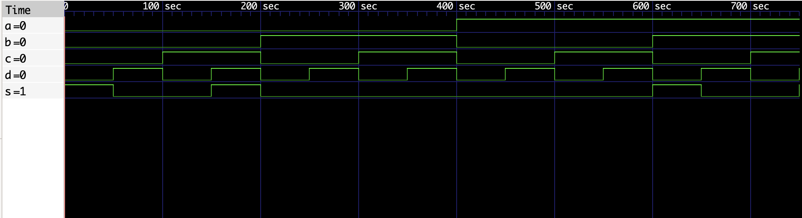
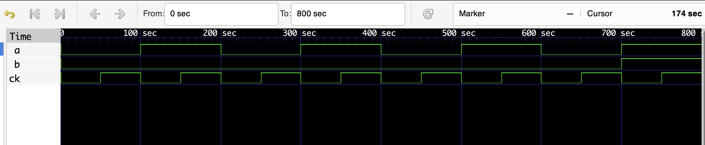
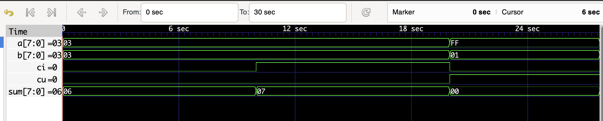

# MICS実験 J2

| 学籍番号 |    氏名    |
| :------: | :--------: |
| 22103421 | 鈴木謙太郎 |

## 問題1

### モジュールeqの動作検証

講義資料で示されたモジュールeqを、同じく示されたeqSimを用いてシミュレーションした。
このモジュールeqは(a & b) | (~a & ~b)を計算するもので、a=bのときだけs=1となっている。

```v
module eq (
    s,a,b
);
    input a, b;
    output s;
    wire na, nb, s1, s2;
    assign na = ~a, nb = ~b;
    assign s1 = a & b, s2 = na & nb;
    assign s = s1 | s2;
endmodule
```

eqSimは、上のモジュールeqに対して予想される4通りの入力をすべて与えて、それぞれの出力を確認するものである。

```v
module eqSim; /* 一致検出回路の */
    wire s; /* シミュレーション */
    reg x, y;
    eq g1(s, x, y);
    initial
        begin
        $dumpfile("eq.vcd");
        $dumpvars(0, eqSim);
        $monitor(" %b %b  %b  %b %b", x, y,  g1.s1, g1.s2,s, $stime);
        $display(" x y s1 s2 s       time");
        x=0; y=0;
        #50 y=1;
        #50 x=1; y=0;
        #50 y=1;
        #50 $finish;
        end
endmodule
```

その結果は下のようになった。

```plaintext
VCD info: dumpfile eq.vcd opened for output.
 x y s time
 0 0 1         0
 0 1 0        50
 1 0 0       100
 1 1 1       150
eqSim.v:15: $finish called at 200 (1s)
```

また、その波形をgtkwaveで表示した結果は下のようになった。


このシミュレーションはすべての入力例をカバーしており、x=yのときのみs=1となることが確認できている。

### eqSimモジュールの改良

eqSimモジュールを以下のように改良し、内部のs1とs2を表示するようにした。

```v
module eqSim; /* 一致検出回路の */
    wire s; /* シミュレーション */
    reg x, y;
    eq g1(s, x, y);
    initial
        begin
        $dumpfile("eq.vcd");
        $dumpvars(0, eqSim);
        $monitor(" %b %b  %b  %b %b", x, y,  g1.s1, g1.s2,s, $stime);
        $display(" x y s1 s2 s       time");
        x=0; y=0;
        #50 y=1;
        #50 x=1; y=0;
        #50 y=1;
        #50 $finish;
        end
endmodule
```

このときの出力は下のようになった。

```bash
VCD info: dumpfile eq.vcd opened for output.
 x y s1 s2 s       time
 0 0  0  1 1         0
 0 1  0  0 0        50
 1 0  0  0 0       100
 1 1  1  0 1       150
eqSim.v:15: $finish called at 200 (1s)
```

これにより、内部的にもs1とs2が正しく計算され、s1|s2から期待されるsが出力されていることが確認できた。

## 問題2

入力信号 a, b, c, d を受け取り，a = b とc = d がともに成り立
つとき出力信号sを1に，それ以外のときsを0にする回路の
モジュールdoubleEqを作成する。

このモジュールの簡易的な回路図は次のようになっている。


これをもとに、以下のようなdoubleEqモジュールを作成した。

```v
module doubleEq(
    s,a,b,c,d
);
    input a, b, c, d;
    output s;
    wire w1, w2;
    eq m1(w1, a, b);
    eq m2(w2, c, d);
    assign s = w1 & w2;
endmodule
```

## 問題3

[問題2](#eqsimモジュールの改良)で作成したdoubleEqモジュールをシミュレーションするdoubleEqSimモジュールを以下のように作成した。
今回は入力ケースがたかだか16通りほどだったので、想定されるすべての入力についてテストを行った。

```v
module doubleEqSim; /* 一致検出回路の */
    wire s; /* シミュレーション */
    reg a, b, c, d;
    doubleEq g1(s, a, b, c, d);
    initial
        begin
        $dumpfile("doubleEq.vcd");
        $dumpvars(0, doubleEqSim);
        $monitor(" %b %b %b %b  %b  %b  %b", a, b, c, d, s, g1.w1, g1.w2, $stime);
        $display(" a b c d w1 w2  s      time");
        /* test all case */
        a=0; b=0; c=0; d=0;
        #50 a=0; b=0; c=0; d=1;
        #50 a=0; b=0; c=1; d=0;
        #50 a=0; b=0; c=1; d=1;
        #50 a=0; b=1; c=0; d=0;
        #50 a=0; b=1; c=0; d=1;
        #50 a=0; b=1; c=1; d=0;
        #50 a=0; b=1; c=1; d=1;
        #50 a=1; b=0; c=0; d=0;
        #50 a=1; b=0; c=0; d=1;
        #50 a=1; b=0; c=1; d=0;
        #50 a=1; b=0; c=1; d=1;
        #50 a=1; b=1; c=0; d=0;
        #50 a=1; b=1; c=0; d=1;
        #50 a=1; b=1; c=1; d=0;
        #50 a=1; b=1; c=1; d=1;
        end
endmodule
```

このテストを実行し、gtkwaveを用いて波形を表示すると以下のようになった。



この波形から、a=bかつc=dのときだけsが1になっていることが視覚的に確認できた。

## 課題4

講義資料で示された状態遷移表m2にしたがって以下のような状態遷移図と真理値表を作成した。


この結果、$b, s1', s2'$の論理式は以下のようになった。

$$
\begin{align}
b &= a s_1 s_2 \notag \\
s1' &= s_1 \bar{s_2} + \bar{a} s_1 + a \bar{s_1} s_2 \notag \\
s2' &= \bar{a} s_2 + a \bar{s_2} \notag
\end{align}
$$

この論理式をもとに、以下のようなモジュールcountを作成した。

```v
module count (
    a,ck,b
);
    input a, ck;
    output b;
    wire na;
    wire s1, s2, t;
    wire d1, d2, d3, d4;
    wire e1, e2, e3;
    dffn f1(s1,d1,ck);
    dffn f2(s2,e1,ck);
    assign na = ~a;
    assign ns1 = ~s1;
    assign ns2 = ~s2;

    assign d4 = s1 & ns2, d3 = na & s1, d2 = a & ns1 & s2, d1 = d4 | d3 | d2;
    assign e3 = na & s2, e2 = a & ns2, e1 = e3 | e2;
    assign b = a & s1 & s2;
endmodule
```

また、このcountモジュールをシミュレーションするcountSimモジュールを以下のように作成した。
$a$の値を切り替える間隔を100サイクルにすることで、$a$を1回切り替える間にclockが0,1両方の場合をテストできるので、効率よくテストカバレッジを高めることができた。

```v
module countSim;
    reg a;
    wire b;

    clk clk1(ck);
    count dut (a,ck,b);

    initial
        begin
        $dumpfile("countSim.vcd");
        $dumpvars(0, countSim);
        $monitor("%b  %b %b  %b  %b", a, ck, b, dut.s1, dut.s2, $stime);
        $display("a ck b s1 s2       time");

        a = 0;
        #100 a = 1;
        #100 a = 0;
        #100 a = 1;
        #100 a = 0;
        #100 a = 1;
        #100 a = 0;
        #100 a = 1;
        #100 a = 0;
        $finish;
        end
endmodule
```

このテストの出力から、状態$s1$と$s2$が正しく遷移していることが確認できた。
また、gtkwaveを用いて波形を表示すると以下のようになった。



この波形から、正しい状態遷移の結果$s1s2$が$11$から$00$に遷移するときに$b=1$となっていることが確認できた。

## 課題5

資料で示された1ビット加算器を参考にして、Nビット加算器addNを作成した。

```v
module addN (
    a, b, sum, ci, cu
);
    parameter N = 8;

    input [N-1:0] a, b;
    input ci;
    output [N-1:0] sum;
    output cu;

    wire [N-1:0] sum;
    wire [N:0] c; // carries
    assign c[0] = ci;


    assign sum = a ^ b ^ c[N-1:0];
    assign c[N:1] = (a & b) | (b & c[N-1:0]) | (a & c[N-1:0]);


    assign cu = c[N];
endmodule
```

また、このaddNモジュールをシミュレーションするaddNSimモジュールを以下のように作成した。

```v
module addNSim (

);
    reg [7:0] a, b;
    reg ci;
    wire [7:0] sum;
    wire cu;
    addN #8 g1(a, b, sum, ci, cu);

    initial begin
        $dumpfile("addN.vcd");
        $dumpvars(0, addNSim);
        $monitor(" %b  %b    %b  %b   %b", a, b,ci, sum, cu, $stime);
        $display("        a         b   ci       sum  cu      time");

        // test normal
        a = 8'b00000011;
        b = 8'b00000011;
        ci = 0;

        // test carry in(下の位から繰り上がることはないが念の為)
        #10;
        a = 8'b00000011;
        b = 8'b00000011;
        ci = 1;

        #10;
        // test overflow
        a = 8'b11111111;
        b = 8'b00000001;
        ci = 0;

        #10 $finish;
    end

endmodule
```

このテストの出力は下のようになった。

```bash
$ ./addNSim
VCD info: dumpfile addN.vcd opened for output.
        a         b   ci       sum  cu      time
 00000011  00000011    0  00000110   0         0
 00000011  00000011    1  00000111   0        10
 11111111  00000001    0  00000000   1        20
addNSim.v:33: $finish called at 30 (1s)
```

また、gtkwaveを用いて波形を表示すると以下のようになった。



これらの結果から、addNモジュールが正しく動作していることが確認できた。
ビットベクトルを用いることで、1ビット加算器の実装を大きく変えることなくNビット加算器を実装できることがわかった。

## 課題6

講義資料で示された1ビットレジスタを参考にして、NビットレジスタregNを作成した。

### dffnモジュールの改良

まず、dffnモジュールをNビット入出力に対応させる必要があると考え、次のように改良した。

```v
module dffn (
    Q,D,ck
);
    parameter N = 1;

    input [N-1:0] D;
    input ck;
    output [N-1:0] Q;
    reg [N-1:0] Q;
    initial
        Q = {N{1'b0}};
    always @(negedge ck)
        Q = D;
endmodule
```

あわせて、dffnモジュールをシミュレーションするdffnSimモジュールも以下のように改良した。

```v
module dffnSim;
    reg[1:0] i;
    wire[1:0] o;
    clk clk1(ck);
    dffn #2 dffn1(o, i, ck);
    initial
        begin
        $dumpfile("dffnSim.vcd");
        $dumpvars(0, dffnSim);
        $monitor(" %b %b %b", ck,i,o,$stime);
        $display("ck  i  o      time");
        i = 2'b00;
        #100 i = 2'b01;
        #200 i = 2'b10;
        #100 $finish;
        end
endmodule
```

このテストの出力は下のようになった。

```bash
$ ./dffnSim
VCD info: dumpfile dffnSim.vcd opened for output.
ck  i  o      time
 0 00 00         0
 1 00 00        50
 0 01 01       100
 1 01 01       150
 0 01 01       200
 1 01 01       250
 0 10 10       300
 1 10 10       350
dffnSim.v:15: $finish called at 400 (1s)
 0 10 10       400
```

また、gtkwaveを用いて波形を表示すると以下のようになった。


これらの結果から、仕様を崩すことなくdffnモジュールをNビット入出力に対応させることができたと判断した。

### regNモジュールの作成
